# Multithreaded Programming Using Pthreads and OpenMP

## Experiment

**Develop Multithreaded Programs Using Parallel Programming Libraries to
Understand Thread Creation, Management, and Coordination**

## 1. Aim

To develop multithreaded programs using **Pthreads and OpenMP** and
understand:

-   Thread creation
-   Thread management
-   Work distribution
-   Race conditions
-   Synchronization
-   Thread coordination
-   Performance improvement using multiple threads

## 2. Basic Idea

A thread is an execution path inside a program. A sequential program
uses one worker to perform the tasks, while a multithreaded program
divides work among several threads.

This experiment uses **Pthreads** and **OpenMP**. The final part
measures whether increasing the number of threads reduces execution
time.

## 3. Software Environment

  Component               Details
  ----------------------- ----------------------------
  Operating System        Windows 11 with WSL Ubuntu
  Compiler                GCC 13.3.0
  Parallel Libraries      Pthreads and OpenMP
  Editor                  Nano
  Available CPU threads   12

### Environment Verification

``` bash
gcc --version
gcc -fopenmp --version
nproc
```

# Part A --- Pthreads

Pthreads stands for **POSIX Threads**. Threads are explicitly created
and managed using functions such as `pthread_create()` and
`pthread_join()`.

## 4.1 Create One Thread

### Objective

Learn how to create a thread, execute a function using the new thread,
and wait for it using `pthread_join()`.

**Source file:** `thread1.c`

### Compilation

``` bash
gcc thread1.c -o thread1 -pthread
```

### Execution

``` bash
./thread1
```

### Output

``` text
Hello from the thread!
Main thread finished.
```

### Result Screenshot

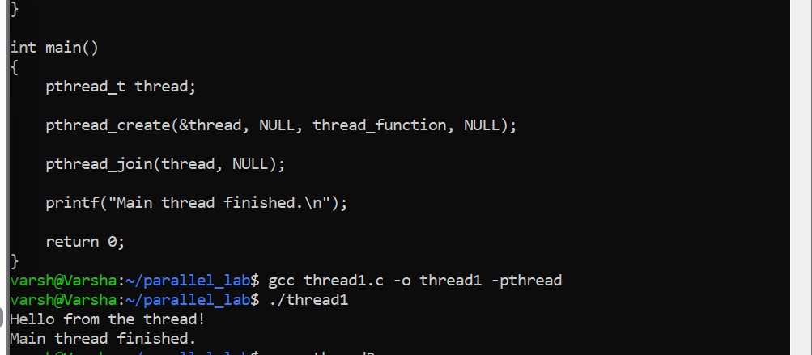

## 4.2 Create Multiple Threads

### Objective

Create and manage multiple threads using Pthreads.

**Source file:** `thread2.c`

### Compilation

``` bash
gcc thread2.c -o thread2 -pthread
```

### Execution

``` bash
./thread2
```

### Output

``` text
Hello from Thread 2
Hello from Thread 1
Hello from Thread 3
Hello from Thread 4
All threads have finished.
```

The order of thread messages can vary because the operating system
schedules the threads independently.

### Result Screenshot

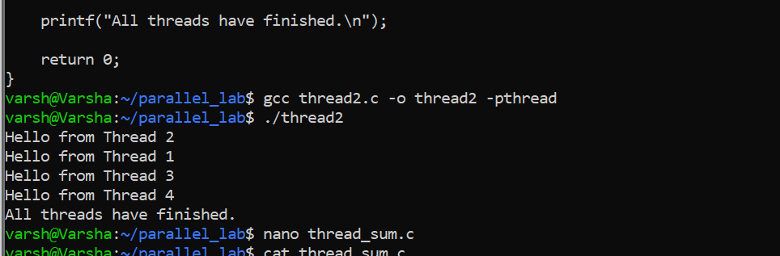

## 4.3 Divide Work Among Threads

### Objective

Divide an array into smaller portions and assign each portion to a
different thread.

**Source file:** `thread_sum.c`

### Compilation

``` bash
gcc thread_sum.c -o thread_sum -pthread
```

### Execution

``` bash
./thread_sum
```

### Output

``` text
Thread 1 calculated sum = 30
Thread 3 calculated sum = 110
Thread 2 calculated sum = 70
Thread 4 calculated sum = 150
Total sum = 360
```

Each thread calculates a partial sum and the main thread combines the
partial results.

### Result Screenshot

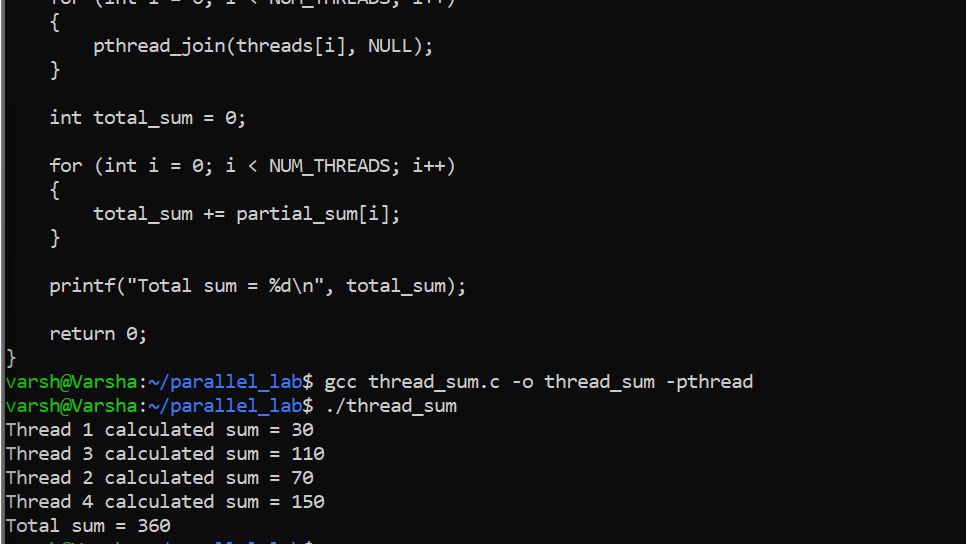

## 4.4 Demonstrate Race Condition

### Objective

Demonstrate how multiple threads modifying shared data without
synchronization can produce an incorrect result.

**Source file:** `race.c`

### Compilation

``` bash
gcc race.c -o race -pthread
```

### Execution

``` bash
./race
```

### Output

``` text
Expected counter = 400000
Actual counter = 166631
```

The actual value is smaller than the expected value because multiple
threads access and update the shared counter without synchronization.

### Result Screenshot

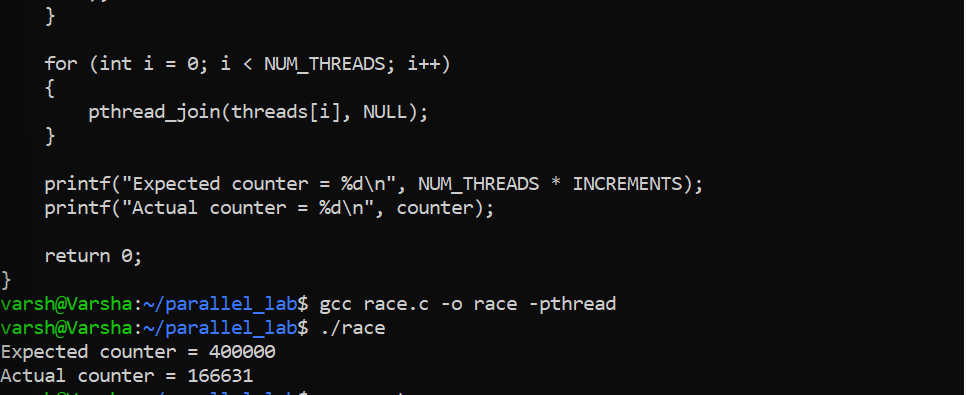

## 4.5 Fix Race Condition Using Mutex

### Objective

Protect the shared counter using a Pthreads mutex.

**Source file:** `mutex.c`

### Compilation

``` bash
gcc mutex.c -o mutex -pthread
```

### Execution

``` bash
./mutex
```

### Output

``` text
Expected counter = 400000
Actual counter = 400000
```

The mutex allows only one thread at a time to execute the protected
counter update.

### Result Screenshot

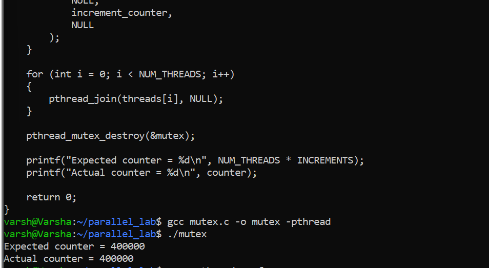

## 4.6 Pthreads Performance

### Objective

Measure execution time using different numbers of Pthreads.

**Source file:** `pthread_perf.c`

### Compilation

``` bash
gcc pthread_perf.c -o pthread_perf -pthread
```

### Execution

``` bash
./pthread_perf
```

The program was executed using 1, 2, 4, 6 and 16 threads.

    Threads   Execution Time (seconds)
  --------- --------------------------
          1                   1.348142
          2                   0.680737
          4                   0.358872
          6                   0.241345
         16                   0.144812

### Result Screenshot


# Part B --- OpenMP

OpenMP provides a higher-level parallel programming model using compiler
directives such as `#pragma omp parallel` and
`#pragma omp parallel for`.

## 5.1 Parallel Region and Thread Identification

### Objective

Create an OpenMP parallel region and identify each thread.

**Source file:** `omp1.c`

### Compilation

``` bash
gcc omp1.c -o omp1 -fopenmp
```

### Execution

``` bash
./omp1
```

The program prints the thread ID and the total number of threads. The
execution environment used 12 available CPU threads, and the order of
messages can vary.

### Result Screenshot

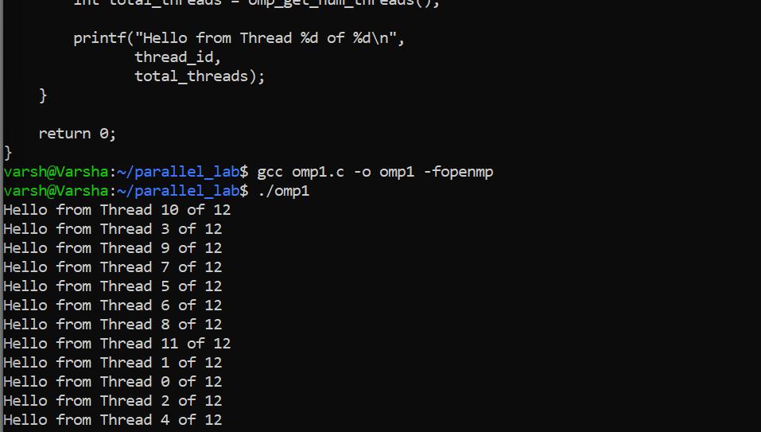

## 5.2 Work Sharing and Reduction

### Objective

Distribute array elements among OpenMP threads and combine the partial
results using reduction.

**Source file:** `omp_sum.c`

### Compilation

``` bash
gcc omp_sum.c -o omp_sum -fopenmp
```

### Execution

``` bash
./omp_sum
```

### Output

``` text
Thread 7 processing array[7] = 80
Thread 0 processing array[0] = 10
Thread 4 processing array[4] = 50
Thread 1 processing array[1] = 20
Thread 3 processing array[3] = 40
Thread 5 processing array[5] = 60
Thread 2 processing array[2] = 30
Thread 6 processing array[6] = 70
Total sum = 360
```

### Result Screenshot

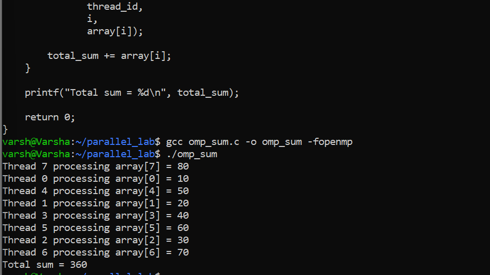

## 5.3 Demonstrate Race Condition

### Objective

Demonstrate a race condition when multiple OpenMP threads update shared
data without synchronization.

**Source file:** `omp_race.c`

### Compilation

``` bash
gcc omp_race.c -o omp_race -fopenmp
```

### Execution

``` bash
./omp_race
```

### Output

``` text
Expected counter = 400000
Actual counter = 100278
```

### Result Screenshot


## 5.4 Synchronization Using Critical

### Objective

Protect the shared counter using an OpenMP critical section.

**Source file:** `omp_critical.c`

### Compilation

``` bash
gcc omp_critical.c -o omp_critical -fopenmp
```

### Execution

``` bash
./omp_critical
```

### Output

``` text
Expected counter = 400000
Actual counter = 400000
```

### Result Screenshot

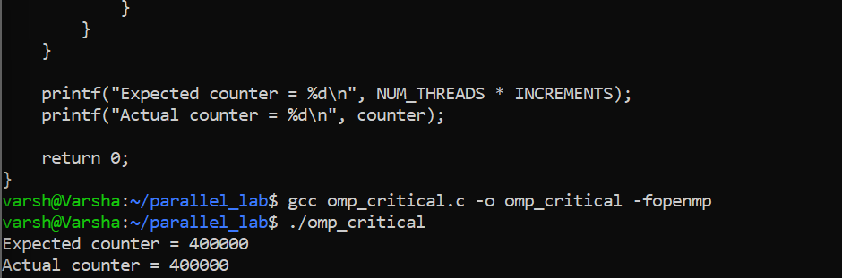

## 5.5 Thread Coordination Using Barrier

### Objective

Demonstrate synchronization between threads using an OpenMP barrier.

**Source file:** `omp_barrier.c`

### Compilation

``` bash
gcc omp_barrier.c -o omp_barrier -fopenmp
```

### Execution

``` bash
./omp_barrier
```

### Output

``` text
Thread 0 completed Stage 1
Thread 2 completed Stage 1
Thread 3 completed Stage 1
Thread 1 completed Stage 1
Thread 0 started Stage 2
Thread 1 started Stage 2
Thread 2 started Stage 2
Thread 3 started Stage 2
```

All Stage 1 messages appear before the Stage 2 messages because the
barrier makes threads wait before continuing.

### Result Screenshot

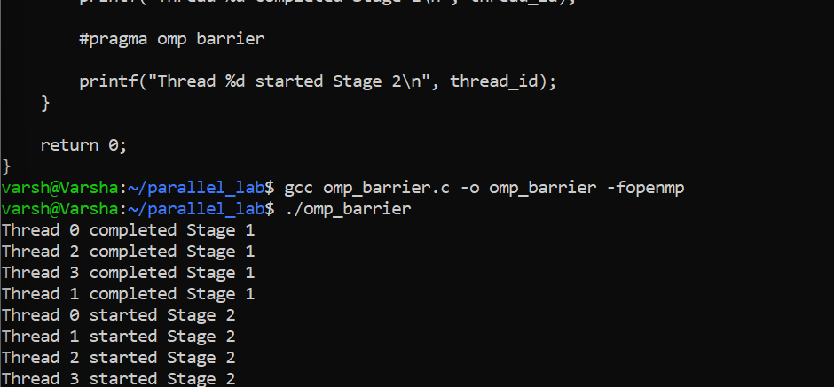

## 5.6 OpenMP Performance

### Objective

Measure execution time using different numbers of OpenMP threads.

**Source file:** `omp_perf.c`

### Compilation

``` bash
gcc omp_perf.c -o omp_perf -fopenmp
```

### Execution

``` bash
./omp_perf
```

    Threads   Execution Time (seconds)
  --------- --------------------------
          1                   1.409294
          2                   0.715560
          4                   0.360803
          6                   0.241608
         16                   0.140692

Result for all runs:

``` text
499999999500.00
```

### Result Screenshot

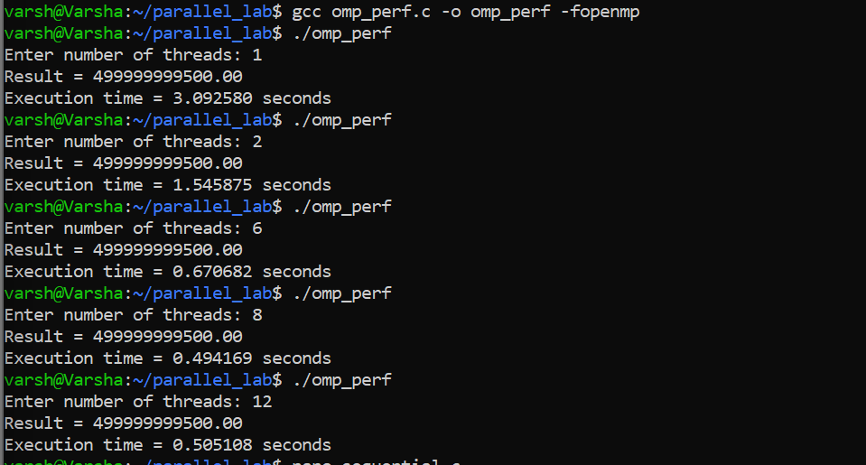

# Part C --- Performance Analysis

## 6.1 Sequential Baseline

The sequential program is used as the baseline for speedup and
efficiency calculations.

**Source file:** `sequential.c`

### Compilation

``` bash
gcc sequential.c -o sequential
```

### Execution

``` bash
./sequential
```

Five runs were measured:

    Run   Time (seconds)
  ----- ----------------
      1         1.353895
      2         1.355794
      3         1.349621
      4         1.353422
      5         1.353365

**Average sequential time: 1.353219 seconds**

### Result Screenshot

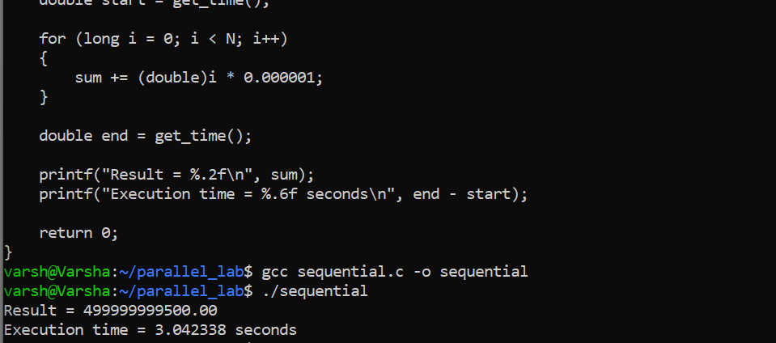

## 6.2 Execution-Time Comparison

    Threads   Pthreads (s)   OpenMP (s)
  --------- -------------- ------------
          1       1.348142     1.409294
          2       0.680737     0.715560
          4       0.358872     0.360803
          6       0.241345     0.241608
         16       0.144812     0.140692

### Execution-Time Graph

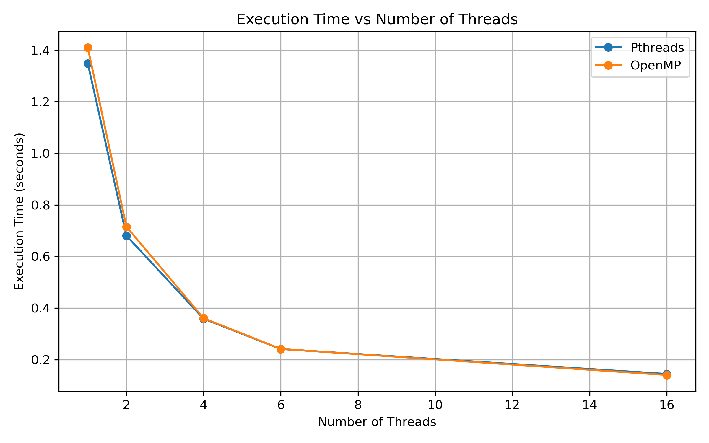

## 6.3 Speedup

**Formula:**

``` text
Speedup = Sequential Time / Parallel Time
```

    Threads   Pthreads Speedup   OpenMP Speedup
  --------- ------------------ ----------------
          1             1.004x           0.960x
          2             1.988x           1.891x
          4             3.771x           3.751x
          6             5.608x           5.601x
         16             9.345x           9.618x

### Speedup Graph

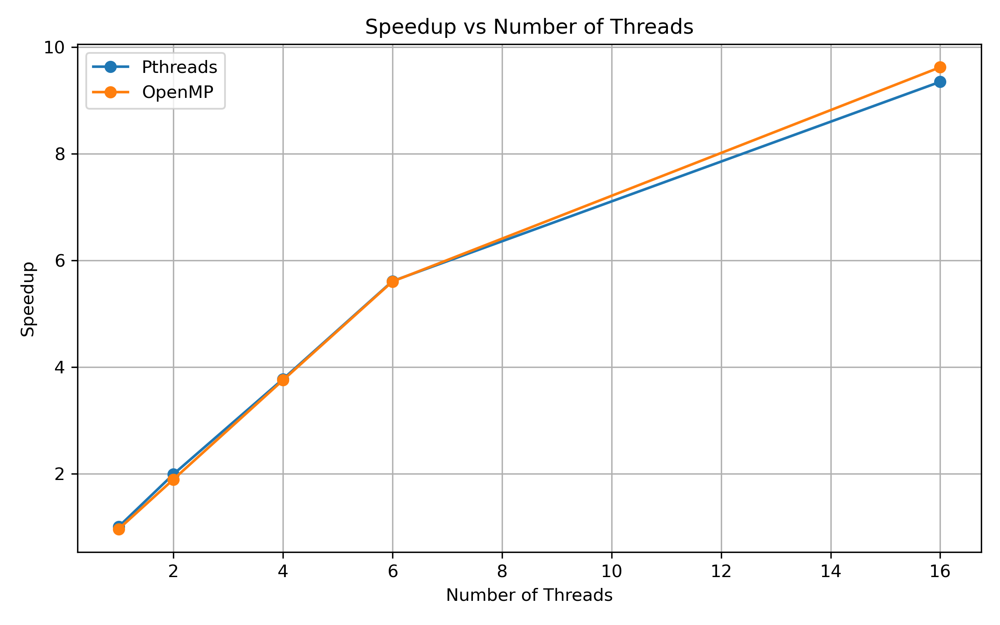

## 6.4 Efficiency

**Formula:**

``` text
Efficiency = (Speedup / Number of Threads) × 100
```

    Threads   Pthreads Efficiency   OpenMP Efficiency
  --------- --------------------- -------------------
          1               100.38%              96.02%
          2                99.39%              94.56%
          4                94.27%              93.76%
          6                93.45%              93.35%
         16                58.40%              60.11%

### Efficiency Graph

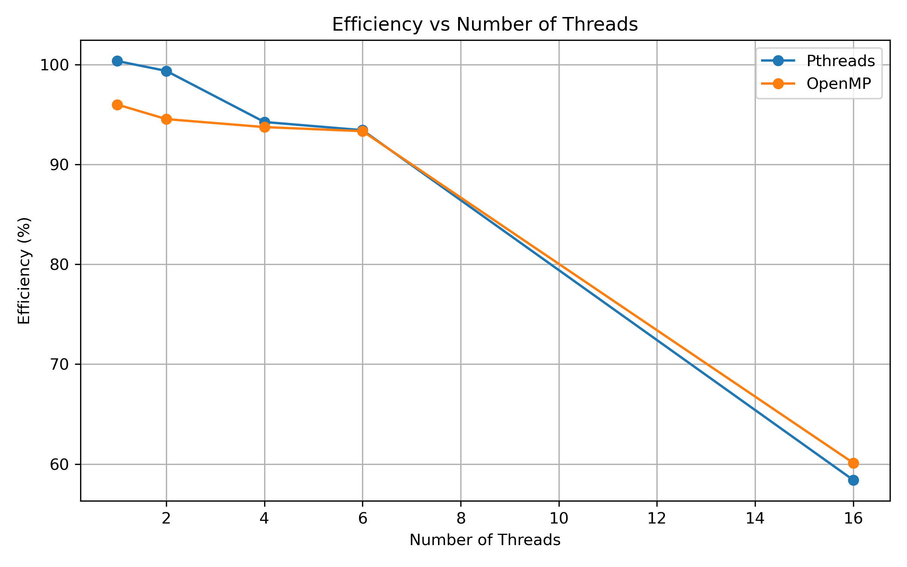

## 6.5 Why Does 16 Threads Not Give 16x Speedup?

Real parallel programs have overhead. Examples include thread
management, scheduling, synchronization, memory access, operating-system
activity, and non-parallel work. Therefore, more threads can reduce
execution time, but speedup is not perfectly linear.

# 7. Pthreads vs OpenMP

  ------------------------------------------------------------------------
  Concept                 Pthreads                OpenMP
  ----------------------- ----------------------- ------------------------
  Create threads          `pthread_create()`      `#pragma omp parallel`

  Wait for threads        `pthread_join()`        OpenMP runtime handles
                                                  completion

  Work distribution       Programmer explicitly   `parallel for` can
                          divides work            distribute loop
                                                  iterations

  Protect shared data     Mutex                   Critical

  Coordination            Join / synchronization  Barrier
                          mechanisms              

  Combine partial results Programmer-managed      Reduction
  ------------------------------------------------------------------------

# 8. Important Terms

-   **Thread:** A path of execution inside a program.
-   **Main thread:** The thread that starts executing `main()`.
-   **Additional thread:** A new thread created by the program.
-   **Multithreading:** Using multiple threads within one program.
-   **Parallel programming:** Dividing work so multiple execution units
    can perform parts of a problem concurrently.
-   **Work distribution:** Dividing one large task into smaller tasks
    and assigning them to threads.
-   **Race condition:** A situation where multiple threads access or
    modify shared data without proper coordination and the result can
    become incorrect.
-   **Mutex:** A locking mechanism used in Pthreads to protect a
    critical section.
-   **Critical section:** A section of code where simultaneous execution
    by multiple threads must be restricted.
-   **Barrier:** A synchronization point where threads wait until
    required threads reach the same point.
-   **Speedup:** How much faster the parallel program is compared with
    the sequential baseline.
-   **Efficiency:** How effectively the available threads produce the
    measured speedup.

# 9. Observations

1.  Pthreads provides explicit control over thread creation and joining.
2.  Work can be divided among multiple Pthreads.
3.  Unsynchronized shared-data access can produce a race condition.
4.  A mutex protects the shared counter and produces the expected
    result.
5.  OpenMP provides a higher-level way to create parallel regions.
6.  `parallel for` can distribute loop iterations among threads.
7.  Reduction combines partial results safely.
8.  A critical section protects a shared operation.
9.  A barrier makes threads wait before moving to the next stage.
10. For the measured workload, execution time generally decreased as the
    number of threads increased.
11. Speedup increased with thread count but was not perfectly linear.
12. Efficiency decreased at the higher thread count because of parallel
    execution overhead.

# 10. Conclusion

The experiment demonstrates how multithreaded programs can be developed
using **Pthreads and OpenMP**.

Pthreads provides explicit control over thread creation, joining, and
mutex-based synchronization. OpenMP provides a higher-level programming
model using parallel regions, work-sharing directives, critical
sections, barriers, and reductions.

The experiments also demonstrate that multiple threads can introduce
race conditions when shared data is not protected. Synchronization
mechanisms such as mutexes and critical sections are therefore required
when threads access shared data.

The performance experiments show that multiple threads can reduce
execution time for the measured workload. However, speedup is not
perfectly proportional to the number of threads because real parallel
programs contain thread-management, scheduling, synchronization,
memory-access, operating-system, and other overheads.

# 11. Project Structure

``` text
parallel_lab/
├── README.md
├── thread1.c
├── thread2.c
├── thread_sum.c
├── race.c
├── mutex.c
├── pthread_perf.c
├── omp1.c
├── omp_sum.c
├── omp_race.c
├── omp_critical.c
├── omp_barrier.c
├── omp_perf.c
├── sequential.c
├── graphs/
│   ├── execution_time.png
│   ├── speedup.png
│   └── efficiency.png
└── screenshots/
    ├── pthreads/
    │   ├── thread1.png
    │   ├── thread2.png
    │   ├── thread_sum.png
    │   ├── race.png
    │   ├── mutex.png
    │   └── pthread_performance.png
    ├── openmp/
    │   ├── omp1.png
    │   ├── omp_sum.png
    │   ├── omp_race.png
    │   ├── omp_critical.png
    │   ├── omp_barrier.png
    │   └── omp_performance.png
    └── performance/
        └── sequential.png
```

# 12. Complete Learning Flow

``` text
Understand Threads
      ↓
Create One Thread
      ↓
Create Multiple Threads
      ↓
Divide Work
      ↓
Shared Data
      ↓
Race Condition
      ↓
Synchronization
      ↓
OpenMP Parallel Region
      ↓
OpenMP Work Sharing
      ↓
OpenMP Race Condition
      ↓
OpenMP Critical Section
      ↓
OpenMP Barrier
      ↓
Sequential Performance
      ↓
Pthreads Performance
      ↓
OpenMP Performance
      ↓
Execution-Time Graph
      ↓
Speedup
      ↓
Speedup Graph
      ↓
Efficiency
      ↓
Efficiency Graph
      ↓
Final Analysis
```
